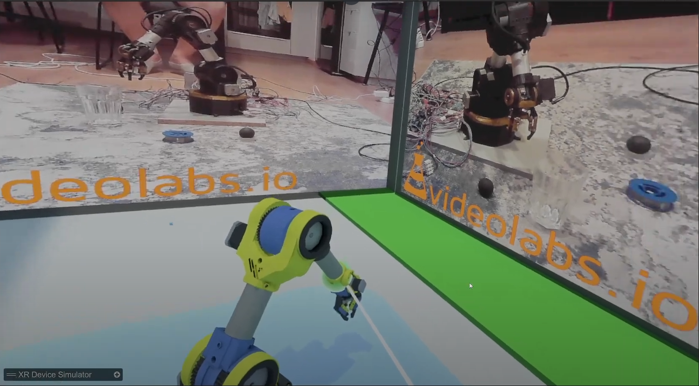
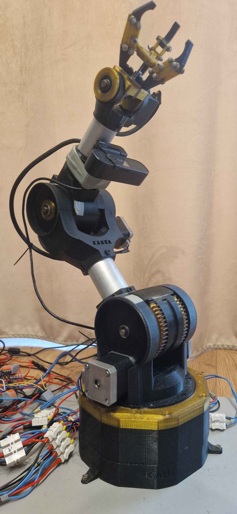

# VR-Controlled Robotic Arm

## Overview

This project implements a system for controlling a robotic arm using virtual reality devices. A robotic arm was built and programmed, and an application was developed to allow precise control using the **Oculus Quest 2** headset and **BigCAVE** ([Gdańsk University of Technology laboratory](https://www.youtube.com/watch?v=huU4aTc9mlo)). The virtual robotic arm’s movements are mirrored in real-time by the physical arm.

The system integrates camera feeds aimed at the robot’s workspace, enabling the operator to assess the environment and improve maneuver precision.

## Features

- **Real-Time VR Control** – Move the virtual robotic arm and see the physical arm replicate the movements.  
- **Oculus Quest 2 & BigCAVE Integration** – Supports advanced VR devices for precise control.  
- **Camera-Based Environment Awareness** – Use live camera feeds to monitor and enhance control.  

## Installation

1. Clone the repository:  

   ```sh
   git clone https://github.com/xTaube/vr-controlled-robot-arm.git
   cd vr-controlled-robot-arm
   ```

2. Deploy server to Raspberry PI:  

   ```sh
   cd raspberry
   export RASPBERRY_ADDRESS=raspberry_pi_address
   make server-remote-deploy
   ```

3. Compile and upload code to Arduino UNO R3:
   
   ```sh
   cd robot
   export UART_PORT=uart_port
   make remote-deploy
   ```

4. Calibrate robot arm via GUI:
   ```sh
   cd gui
   python gui.py
   ```

5. Launch VR application.


## Usage

1. Wear your **Oculus Quest 2** or use **BigCAVE**.  
2. Start the application to control the robotic arm.  
3. Use the camera feed to guide your movements.  

## Demonstration

### 🎥 Watch the Demo  
[](https://www.youtube.com/watch?v=huU4aTc9mlo)
 

### VR Control Interface  


### Physical Robotic Arm  

 
